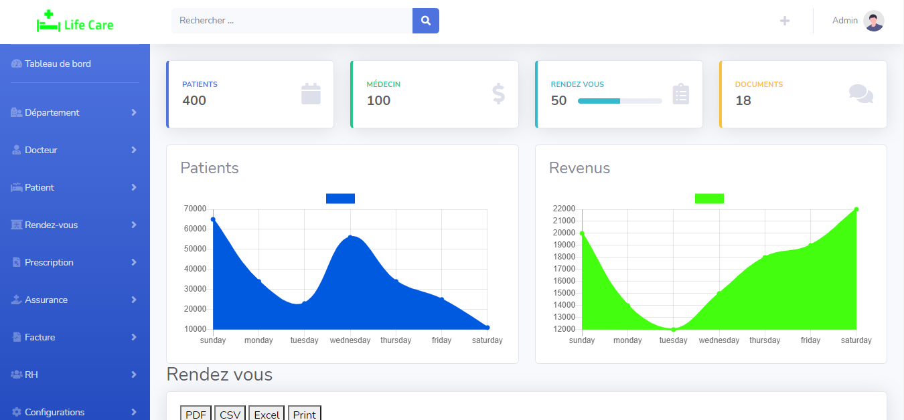

## Introduction

Life Care is a comprehensive hospital management tool.It is an all-in-one solution that can help you run a hospital for both medical and non-medical sides. Life Care provides all necessary features required to run a hospital as a doctor, cashier, accountant, laboratories, pharmacist, receptionist or nurse

## Informations
-   Status : under development
-   Latest version : 1.0
-   Sector: medical
-   Created: November 2020
-   Last updated: November 2020

## Table of contents
* [Documentation](#general-info)
* [Demo](#demo)
* [Screenshots](#screenshots)
* [Technologies](#technologies)
* [Setup](#setup)
* [Features](#features)
* [Status](#status)
* [Contact](#contact)
* [License](#license)

## Documentation
https://github.com/aniskchaou/LIFECARE-FRONTEND-ADMIN/wiki

## Demo
https://life-care-app.herokuapp.com/

## Screenshots

## Technologies
* Spring boot
* Node.js
* Angular

## Setup

## Features
 -   Manage patients
 - Manage doctors
 - Manage appointments 
 - Manage medications 
 - Manage prescriptions 
 - Manage invoices 
 -  Manage insurance 
 - Manage the HR department

  

## Contact
contact@delta-dev-software.com

## License
<a href="license.txt">MIT License</a>